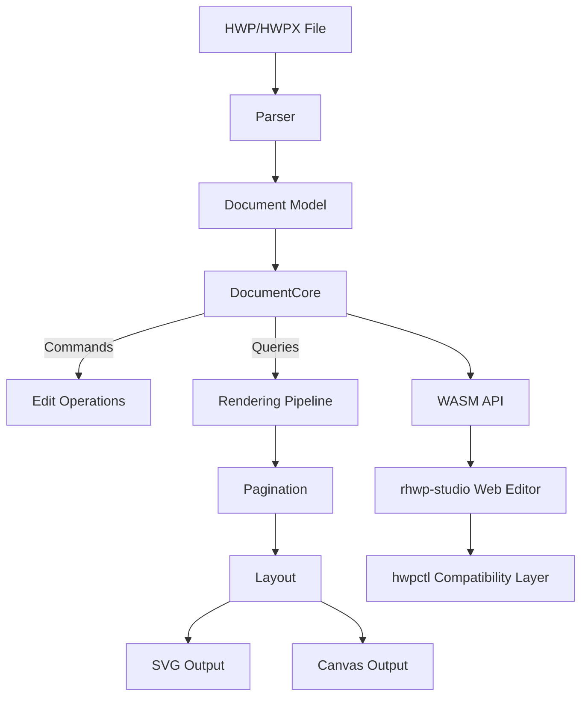

# rhwp

**Open-source HWP document viewer and editor** written in Rust + WebAssembly.

> 한컴 웹한글(웹기안기)의 오픈소스 대안을 목표로 합니다.

[](https://opensource.org/licenses/MIT)
[](https://www.rust-lang.org/)
[](https://webassembly.org/)

## Features

### Parsing (파싱)
- HWP 5.0 binary format (OLE2 Compound File)
- HWPX (Open XML-based format)
- Sections, paragraphs, tables, textboxes, images, equations, charts
- Header/footer, master pages, footnotes/endnotes

### Rendering (렌더링)
- **Paragraph layout**: line spacing, indentation, alignment, tab stops
- **Tables**: cell merging, border styles (solid/double/triple/dotted), cell formula calculation
- **Multi-column layout** (2-column, 3-column, etc.)
- **Paragraph numbering/bullets**
- **Vertical text** (영문 눕힘/세움)
- **Header/footer** (odd/even page separation)
- **Master pages** (Both/Odd/Even, is_extension/overlap)
- **Object placement**: TopAndBottom, treat-as-char (TAC), in-front-of/behind text

### Equation (수식)
- Fractions (OVER), square roots (SQRT/ROOT), subscript/superscript
- Matrices: MATRIX, PMATRIX, BMATRIX, DMATRIX
- Cases, alignment (EQALIGN), stacking (PILE/LPILE/RPILE)
- Large operators: INT, DINT, TINT, OINT, SUM, PROD
- Relations (REL/BUILDREL), limits (lim), long division (LONGDIV)
- 15 text decorations, full Greek alphabet, 100+ math symbols

### Pagination (페이지 분할)
- Multi-column document column/page splitting
- Table row-level page splitting (PartialTable)
- shape_reserved handling for TopAndBottom objects
- vpos-based paragraph position correction

### Output (출력)
- SVG export (CLI)
- Canvas rendering (WASM/Web)
- Debug overlay (paragraph/table boundaries + indices + y-coordinates)

### Web Editor (웹 에디터)
- Text editing (insert, delete, undo/redo)
- Character/paragraph formatting dialogs
- Table creation, row/column insert/delete, cell formula
- hwpctl-compatible API layer (한컴 웹기안기 호환)

### hwpctl Compatibility (한컴 호환 레이어)
- 30 Actions: TableCreate, InsertText, CharShape, ParagraphShape, etc.
- ParameterSet/ParameterArray API
- Field API: GetFieldList, PutFieldText, GetFieldText
- Template data binding support

## Quick Start

처음 프로젝트에 참여하는 개발자는 [온보딩 가이드](mydocs/manual/onboarding_guide.md)를 먼저 읽어보세요. 프로젝트 아키텍처, 디버깅 도구, 개발 워크플로우를 한눈에 파악할 수 있습니다.

### Requirements
- Rust 1.75+
- Docker (for WASM build)
- Node.js 18+ (for web editor)

### Native Build

```bash
cargo build                    # Development build
cargo build --release          # Release build
cargo test                     # Run tests (755+ tests)
```

### WASM Build

WASM 빌드는 Docker를 사용합니다. 플랫폼에 관계없이 동일한 `wasm-pack` + Rust 툴체인 환경을 보장하기 위함입니다.

```bash
cp .env.docker.example .env.docker   # 최초 1회: 환경변수 템플릿 복사
docker compose --env-file .env.docker run --rm wasm
```

빌드 결과물은 `pkg/` 디렉토리에 생성됩니다.

### Web Editor

```bash
cd rhwp-studio
npm install
npx vite --host 0.0.0.0 --port 7700
```

Open `http://localhost:7700` in your browser.

## CLI Usage

### SVG Export

```bash
rhwp export-svg sample.hwp                         # Export to output/
rhwp export-svg sample.hwp -o my_dir/              # Export to custom directory
rhwp export-svg sample.hwp -p 0                    # Export specific page (0-indexed)
rhwp export-svg sample.hwp --debug-overlay         # Debug overlay (paragraph/table boundaries)
```

### Document Inspection

```bash
rhwp dump sample.hwp                  # Full IR dump
rhwp dump sample.hwp -s 2 -p 45      # Section 2, paragraph 45 only
rhwp dump-pages sample.hwp -p 15     # Page 16 layout items
rhwp info sample.hwp                  # File info (size, version, sections, fonts)
```

### Debugging Workflow

1. `export-svg --debug-overlay` → Identify paragraphs/tables by `s{section}:pi={index} y={coord}`
2. `dump-pages -p N` → Check paragraph layout list and heights
3. `dump -s N -p M` → Inspect ParaShape, LINE_SEG, table properties

No code modification needed for the entire debugging process.

## Project Structure

```
src/
├── main.rs                    # CLI entry point
├── parser/                    # HWP/HWPX file parser
├── model/                     # HWP document model
├── document_core/             # Document core (CQRS: commands + queries)
│   ├── commands/              # Edit commands (text, formatting, tables)
│   ├── queries/               # Queries (rendering data, pagination)
│   └── table_calc/            # Table formula engine (SUM, AVG, PRODUCT, etc.)
├── renderer/                  # Rendering engine
│   ├── layout/                # Layout (paragraph, table, shapes, cells)
│   ├── pagination/            # Pagination engine
│   ├── equation/              # Equation parser/layout/renderer
│   ├── svg.rs                 # SVG output
│   └── web_canvas.rs          # Canvas output
├── serializer/                # HWP file serializer (save)
└── wasm_api.rs                # WASM bindings

rhwp-studio/                   # Web editor (TypeScript + Vite)
├── src/
│   ├── core/                  # Core (WASM bridge, types)
│   ├── engine/                # Input handlers
│   ├── hwpctl/                # hwpctl compatibility layer
│   ├── ui/                    # UI (menus, toolbars, dialogs)
│   └── view/                  # Views (ruler, status bar, canvas)
├── e2e/                       # E2E tests (Puppeteer + Chrome CDP)
│   └── helpers.mjs            # Test helpers (headless/host modes)

mydocs/                        # Project documentation (Korean)
├── orders/                    # Daily task tracking
├── plans/                     # Task plans and implementation specs
├── feedback/                  # Code review feedback
├── tech/                      # Technical documents
└── manual/                    # Manuals and guides

scripts/                       # Build & quality tools
├── metrics.sh                 # Code quality metrics collection
└── dashboard.html             # Quality dashboard with trend tracking
```

## Development with Claude Code

This project is developed using **Claude Code** (Anthropic's AI coding agent) as a pair programming partner. The entire development process — from task planning to implementation to code review — is documented in `mydocs/`.

### Human-AI Collaboration Protocol

1. **Task Registration**: `mydocs/orders/yyyymmdd.md`
2. **Plan Approval**: `mydocs/plans/task_{N}.md` → review → approval
3. **Implementation**: `local/task{N}` branch → implement → test
4. **Debug Protocol**: `--debug-overlay` + `dump-pages` + `dump` for precise paragraph identification
5. **Code Review**: 4 rounds of code review documented in `mydocs/feedback/`

> The documentation in `mydocs/` serves as an educational resource for AI-assisted software development.

## Architecture



## HWPUNIT

- 1 inch = 7,200 HWPUNIT
- 1 inch = 25.4 mm
- 1 HWPUNIT ≈ 0.00353 mm

## Contributing

See [CONTRIBUTING.md](CONTRIBUTING.md) for guidelines.

## License

[MIT License](LICENSE) — Copyright (c) 2025-2026 Edward Kim
